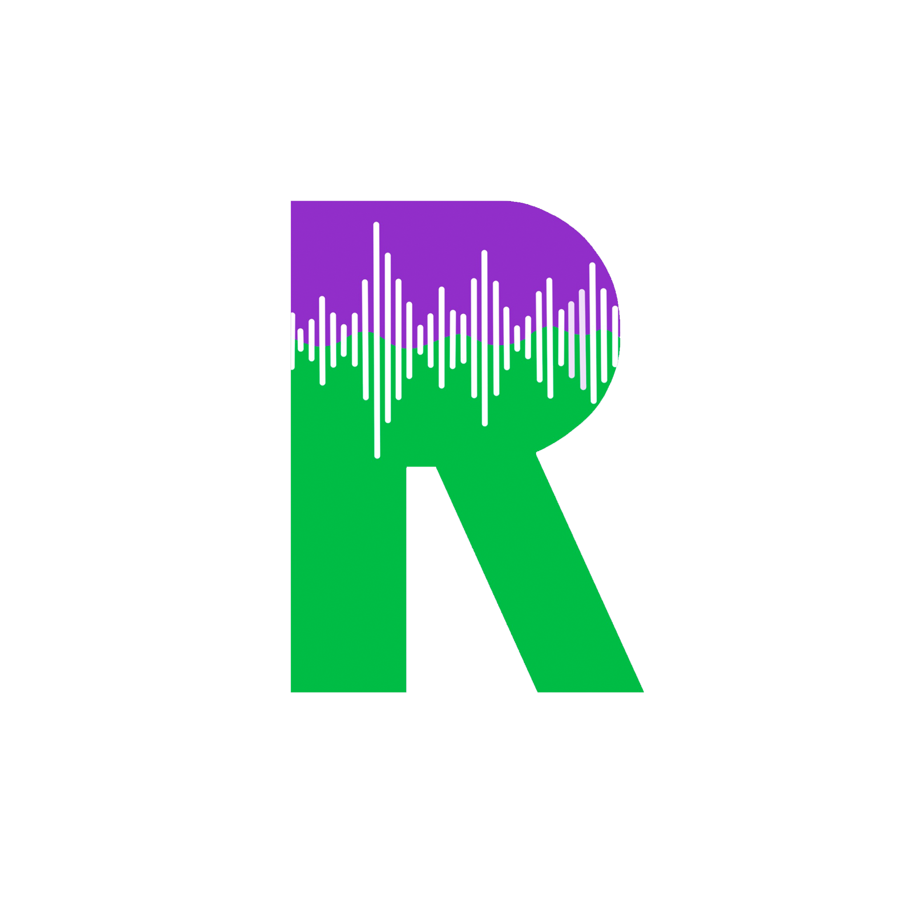

<h1 align="center">
<br>
<a href="https://github.com/soprafs22-group17"></a>
<br>
RaveWave-Server
<br>
</h1>


https://user-images.githubusercontent.com/75266614/219971025-e3cb30f4-41df-4425-964b-cb40f9b141cd.mp4


## Introduction

By combining Kahoot with Spotify, RaveWave creates a competitive and fun music guessing game to play among friends. This is the
repository of the back-end part of our implementation, you'll find the front-end part [here](https://github.com/sopra-fs22-group-17/RaveWave-client).

## Technologies

The back-end is written in Java and uses Spring Boot framework. We use JPA for persistence and the deployment is
handled by Heroku. Communication between the server and the client is done with REST and websockets. For the
websockets an additional messaging protocol called STOMP is used.

## High-level components

The [controllers](https://github.com/sopra-fs22-group-17/RaveWave-server/tree/master/src/main/java/ch/uzh/ifi/hase/soprafs22/controller) receive all REST and websocket calls and pass them onto the [Services](https://github.com/sopra-fs22-group-17/RaveWave-server/tree/master/src/main/java/ch/uzh/ifi/hase/soprafs22/service). In our [gametypes](https://github.com/sopra-fs22-group-17/RaveWave-server/tree/master/src/main/java/ch/uzh/ifi/hase/soprafs22/entity/gametypes) package, which is controlled by the [Game](https://github.com/sopra-fs22-group-17/RaveWave-server/blob/master/src/main/java/ch/uzh/ifi/hase/soprafs22/entity/Game.java) class,
the different questions are generated with the help of the Spotify package. There we get access
through the [Spotify Web API](https://developer.spotify.com/documentation/web-api/), which is based on REST principles and
gives access to songs and their metadata, as well as Spotify user related information.


## Launch & Deployment

### Build

```bash
./gradlew build
```

### Run

```bash
./gradlew bootRun
```

### Test

```bash
./gradlew test
```

## Roadmap

- New game mode: Guess the lyrics
- Global RaveWAver leaderboard
- Submit Quota Extension request (takes about six weeks)

## Authors and Acknowledgment

SoPra Group 17 2022 consists of [Marco Leder](https://github.com/marcoleder), [Valentin Hollenstein](https://github.com/v4lentin1879),
[Dennys Huber](https://github.com/devnnys), [Sheena Lang](https://github.com/SheenaGit) and [Isabella Chesney](https://github.com/bellachesney).

We first want to thank our teaching assistant [Tarek Alakmeh](https://github.com/orgs/sopra-fs22-group-17/people/Taremeh) for his help during the
last semester, as well as our previous teaching assistant [Kyrill Hux](https://github.com/realChesta).
We also thank Spotify for providing such a well documented API and Kahoot for the inspiration. It has been a very
educational and challenging semester, and we are very thankful for this experience.

## License

Apache-2.0 license
